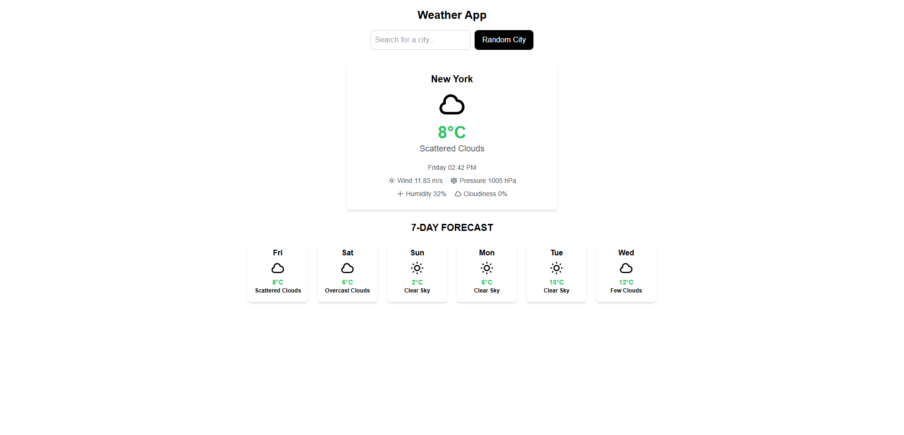

# Weather App 🌤️

A modern weather application built with **TypeScript**, **React**, and **Tailwind CSS**. Check the current weather and 7-day forecast for any city in the world.

 <!-- Add a screenshot of your app here -->

---

## Features ✨

- **Current Weather**: Get real-time weather data for your location or any city.
- **7-Day Forecast**: View the weather forecast for the next 7 days.
- **Search by City**: Search for weather information in any city worldwide.
- **Random City**: Discover the weather in a random city.
- **Responsive Design**: Works seamlessly on all devices.

---

## Technologies Used 🛠️

- **TypeScript**: For type-safe and scalable code.
- **React**: For building the user interface.
- **Tailwind CSS**: For modern and responsive styling.
- **Vite**: For fast development and bundling.
- **OpenWeatherMap API**: For weather data.

---

## Installation 🚀

1. **Clone the repository:**
   ```bash
   git clone https://github.com/your-username/weather-app.git
   ```

2. **Navigate to the project directory:**
   ```bash
   cd weather-app
   ```

3. **Install dependencies:**
   ```bash
   npm install
   ```

4. **Start the development server:**
   ```bash
   npm run dev
   ```

5. **Open your browser and visit:**
   ```
   http://localhost:5173
   ```

---

## How to Use 🧭

- **Search for a City**: Enter the name of a city in the search bar.
- **Random City**: Click the "Random City" button to get weather for a random location.
- **View Forecast**: Scroll down to see the 7-day weather forecast.

---

## Contributing 🤝

Contributions are welcome! If you'd like to improve this project, follow these steps:

1. **Fork the repository.**
2. **Create a new branch:**
   ```bash
   git checkout -b feature/your-feature-name
   ```
3. **Commit your changes:**
   ```bash
   git commit -m "Add your feature"
   ```
4. **Push to the branch:**
   ```bash
   git push origin feature/your-feature-name
   ```
5. **Open a pull request.**

---

## License 📄

This project is licensed under the MIT License. See the LICENSE file for details.

---

## Credits 🙌

- **OpenWeatherMap**: For providing the weather data API.
- **Vite**: For the fast development environment.
- **Tailwind CSS**: For the amazing utility-first CSS framework.

---

## Live Demo 🌐

Check out the live demo: [Weather App Live](https://weather-app-kappa-blond-24.vercel.app/)

---

## About the Creator 🚀

Created by [Nicolás Nicholson](https://www.linkedin.com/in/nicolasnicholson)